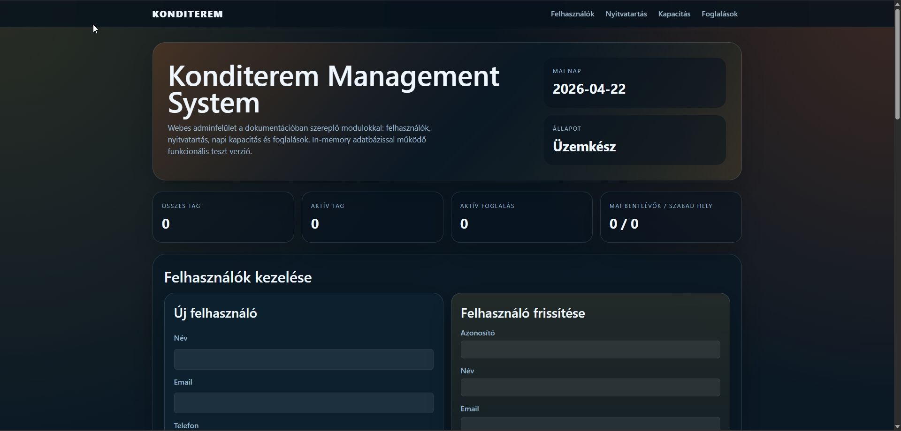
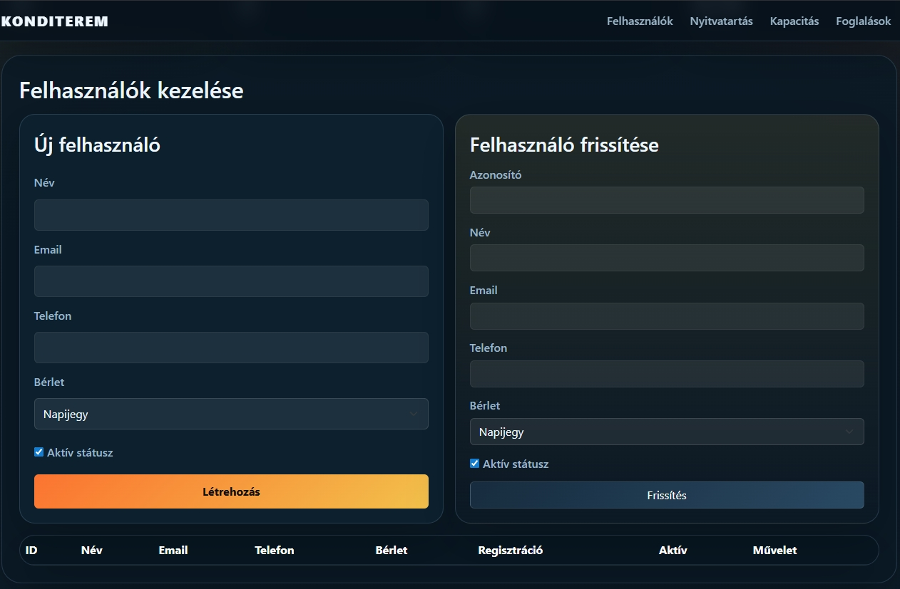
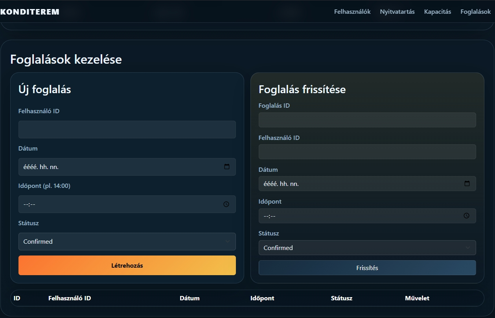

# Konditerem Management System

A web-based gym administration system built with F# and ASP.NET Core MVC. 

This repository contains two projects: an initial in-memory prototype (**Project Alpha**) and a final application with persistent database storage (**Project Omega**).

## Motivation

Managing a gym's daily operations (tracking members, schedules, capacity, and bookings) is often done on paper or with scattered tools. This project digitizes that workflow into a single web interface. 

It was originally developed as a Java application and later ported to F# to explore functional programming concepts such as immutable data modeling, pattern matching, and result-based error handling. The user interface is optimized for desktop environments, targeting reception desk usage where data tables require larger screen real estate.

---

## 📌 Project Structure
* 📂 [**Project Omega**](./Project_Omega) — The final submission with SQLite database, validation, and Hungarian localization.
* 📂 [**Project Alpha**](./Project_Alpha) — The early in-memory prototype.

---

## 🎯 Core Features
* **Users:** Create, update, delete; membership types (daily, monthly, quarterly, annual, student); active/inactive status.
* **Opening Hours:** Weekly schedule management.
* **Capacity:** Daily headcount tracking with real-time check-in/check-out.
* **Bookings:** Status management (confirmed, pending, cancelled).

---

## 🚀 Project Omega (Final Version)

This is the production-ready state of the application. It replaces the in-memory data layer with an SQLite database and introduces strict validation.

**Try Live:** [https://kondi.1elet.hu/omega](https://kondi.1elet.hu/omega)

### Key Technical Details
* **Storage:** SQLite database using ADO.NET in F#.
* **Validation:** 
  * Server-side F# Regex validation for Emails (requires `@` and a valid TLD).
  * Server-side validation for Phone numbers (8-15 digits, numeric only).
  * Client-side HTML5 pattern constraints.
* **Localization:** The UI and error messages are translated to Hungarian.
* **Database Seeding:** The application automatically creates the database and populates a default 7-day opening hours schedule on the first run.

### Database Schema
The database uses a normalized schema with the following tables:
1. `users`: `id` (PK), `full_name`, `email`, `phone`, `membership_type`, `status`.
2. `bookings`: `id` (PK), `user_id` (FK to users), `booking_date`, `start_time`, `end_time`, `status`.
3. `opening_hours`: `id` (PK), `day_of_week`, `open_time`, `close_time`.
4. `capacity_log`: `id` (PK), `date`, `current_count`.

*(Extensibility: The schema is designed so that future features, like a `payments` table or detailed `access_logs`, can be easily linked to the `users` table via foreign keys.)*

---

## 🛠️ Project Alpha (Initial Prototype)

The Alpha version uses an in-memory data layer to demonstrate the domain logic without external dependencies. The UI in this prototype is in English.

**Try Live:** [https://kondi.1elet.hu/alpha](https://kondi.1elet.hu/alpha)

### UI Screenshots (from Alpha)
<details>
<summary>Click to view screenshots</summary>
<br>







</details>

---

## ⚙️ Tech Stack & Folders

| Layer | Technology |
| :--- | :--- |
| **Language** | F# (.NET 8.0) |
| **Framework** | ASP.NET Core MVC |
| **Database** | SQLite (`Microsoft.Data.Sqlite`) |
| **View** | Razor (`.cshtml`) + Vanilla CSS + Bootstrap Grid |

```text
due-fsharp-2026/
├── Project_Alpha/          # Initial prototype (In-memory)
└── Project_Omega/          # Final submission (SQLite)
    ├── App_Data/           # Database file
    ├── Models/Domain.fs    # F# Records & Types
    ├── Data/               # SQLite Gym Repository
    ├── Controllers/        # ASP.NET MVC Controllers
    ├── Views/              # Razor Pages (UI)
    └── Program.fs          # Application Entry Point
```

## How to Build and Run

### Running Project Omega (Final)
```bash
cd Project_Omega
dotnet run
```

### Running Project Alpha
```bash
cd Project_Alpha
dotnet run
```
